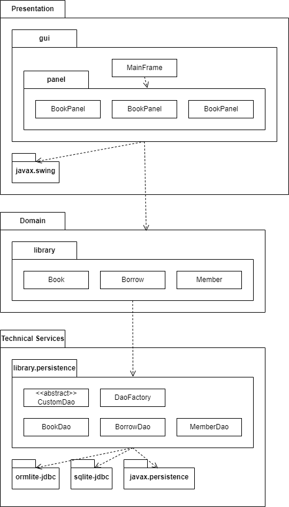
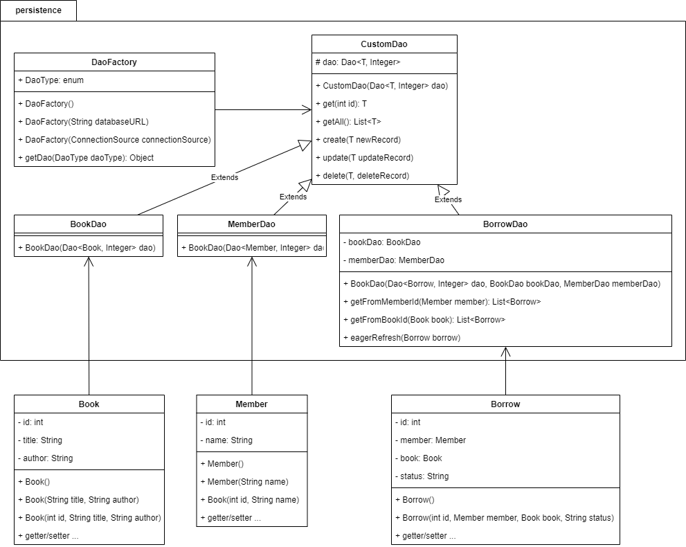
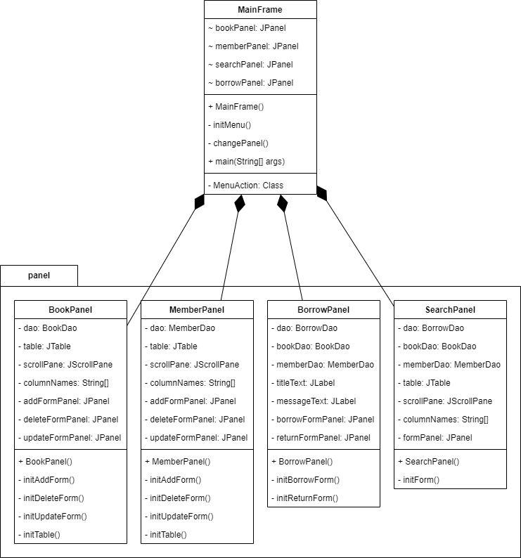

# DAO Library

Library book borrowing software that doesn't care about time.

This library has no limit amount of each book, so it will keep only borrowed/returned status only.

Thanks for the book data from [The Greatest Book](https://thegreatestbooks.org/).

## Requirements
We need `Java 17`. In my case, I use `openjdk17`
.

Edit: I have tested on `Java 11` using `corretto-11`, it works just fine.

## Initialize Database
For the Window,
```
# create the database using specified schema
sqlite3 library.db -init library.schema

# import data from csv files
sqlite3> .mode csv
sqlite3> .import --skip 1 data/book.csv book
sqlite3> .import --skip 1 data/member.csv member
sqlite3> .import --skip 1 data/borrow.csv borrow
```

## Package Diagram



## Class Diagrams

### Library Package



### GUI Package



## Web Service API

### Overview
Our web service API provides the ability to access library information which are book, member, and borrow status.

### Authentication
Some services need authentication. In order to use these APIs, you have to include your authentication token as a part of HTTP request header. Now only librarians have the API token.

```
Authorization: Token <your-token>
```

### Data Objects

The following are data object that have been used in our API service.

#### Book Object

| Parameter | type   | Description   |
|-----------|--------|---------------|
| id        | int    | book's id     |
| title     | string | book's title  |
| author    | string | book's author |  

Example
```json
{
  "id": 1,
  "title": "In Search of Lost Time",
  "author": "Marcel Proust"
}
```

#### Member Object

| Parameter | type   | Description        |
|-----------|--------|--------------------|
| id        | int    | member's id        |
| name      | string | member's full name |

Example
```json
{
  "id": 1,
  "name": "Aaisha Hough"
}
```

#### Borrow Object

| Parameter | type         | Description                                              |
|-----------|--------------|----------------------------------------------------------|
| id        | int          | borrow id                                                |
| member    | MemberObject | borrower                                                 |
| book      | BookObject   | borrowed book                                            |
| status    | char         | borrowing status, 'B' means borrowed, 'R' means returned |

Example
```json
{
  "id": 1,
  "member": {
    "id": 1,
    "name": "Aaisha Hough"
  },
  "book": {
    "id": 1,
    "title": "In Search of Lost Time",
    "author": "Marcel Proust"
  },
  "status": "B"
}
```

### APIs

| Request        | API                     | Description                                              | Return                                 |
|----------------|-------------------------|----------------------------------------------------------|----------------------------------------|
| GET            | /api/book               | request for the list of all books                        | List of [BookObject](#book-object)     |
| &#128274; POST | /api/book               | add new book to the library                              | Message                                |
| GET            | /api/book/{book-id}     | request for the specific book using book id              | A [BookObject](#book-object)           |
| GET            | /api/member             | request for the list of all members                      | List of [MemberObject](#member-object) |
| &#128274; POST | /api/member             | add new member to the library                            | Message                                | 
| GET            | /api/member/{member-id} | request for specific member information using member id  | A [MemberObject](#member-object)       |
| GET            | /api/borrow/{borrow-id} | request for the status of book in specific borrow        | A [BorrowObject](#borrow-object)       |
| &#128274; PUT  | /api/borrow/{borrow-od} | update book borrowing status                             | Message                                |
| &#128274; POST | /api/borrow             | add new book borrowing record                            | Message                                |

API with &#128274; means this API needs authentication.
